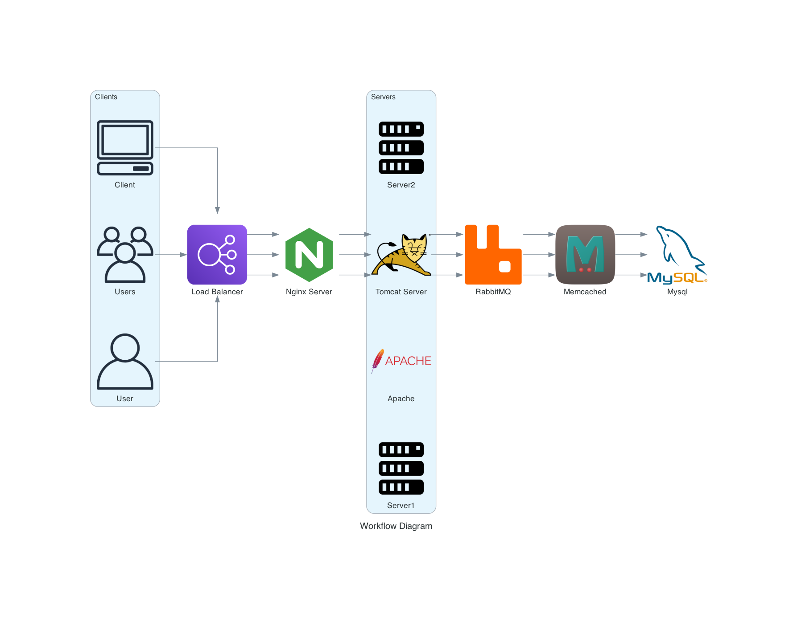
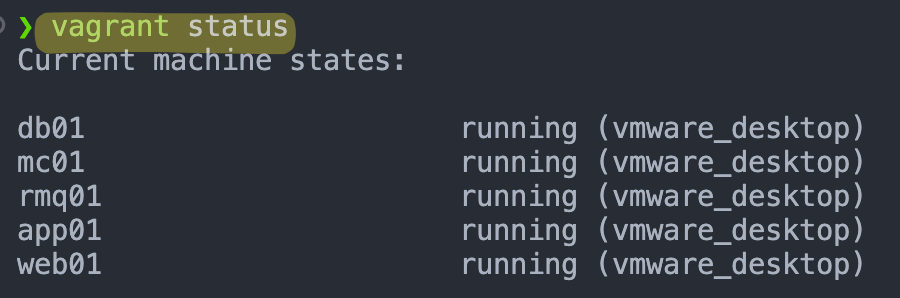
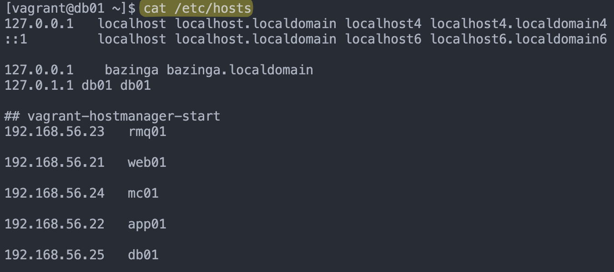
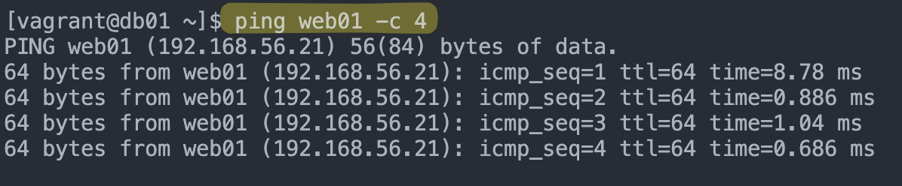
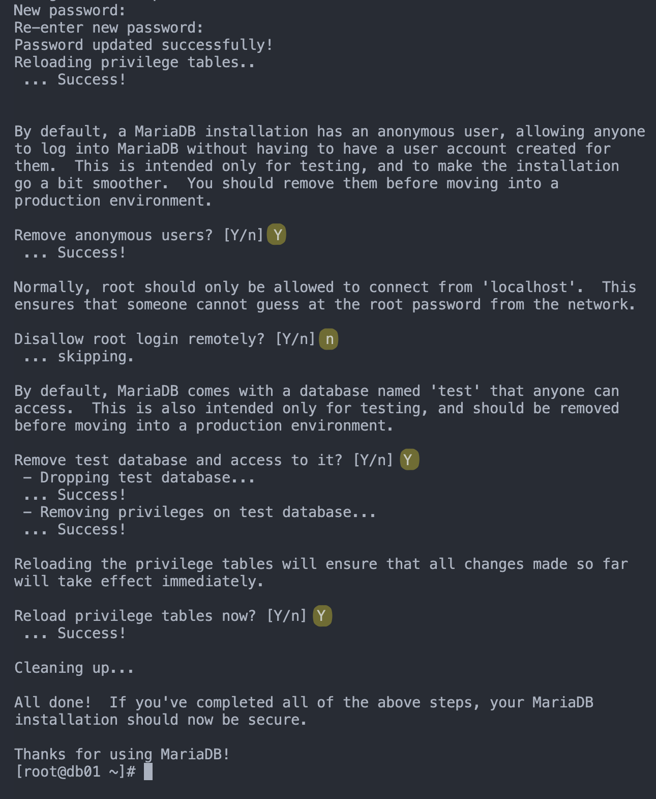
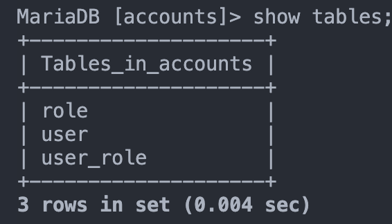
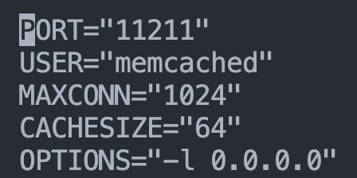
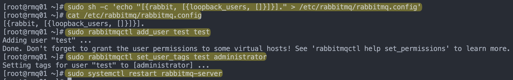
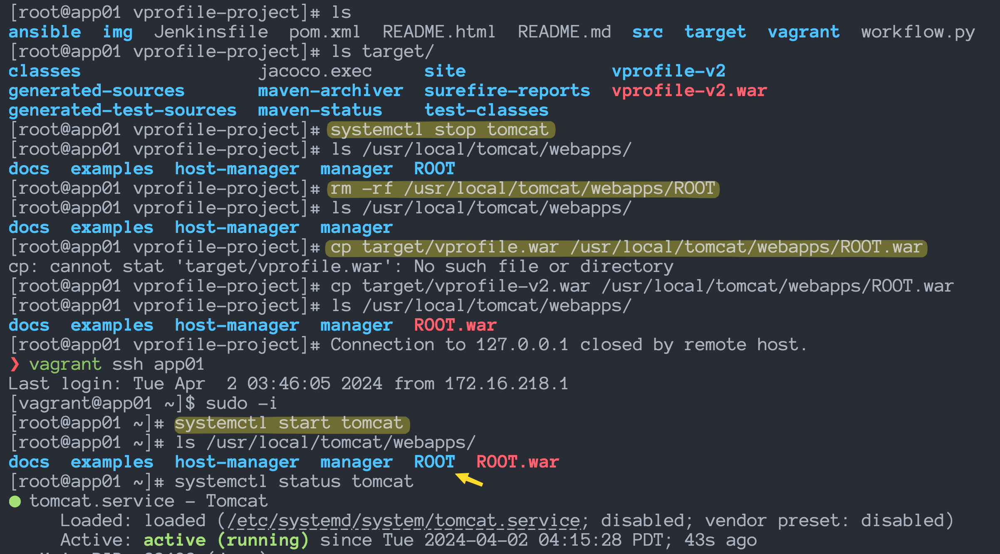
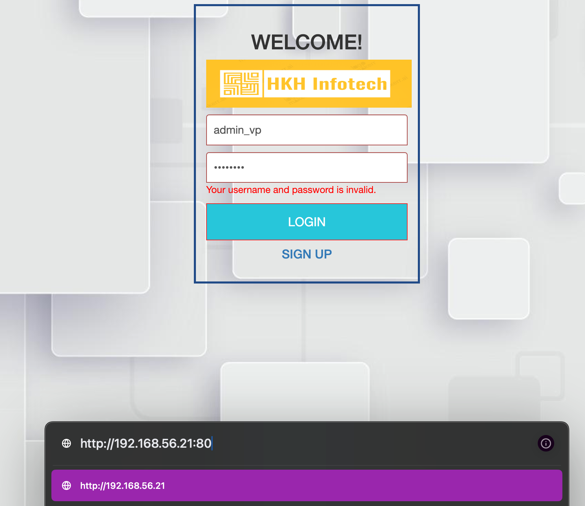

# vprofile-project

This project is a multi-machine environment on M series Macbook Pro, with the following machines:

- Simple project to run and understand the workflow of web applications.
- MySQL, Memcache, RabbitMQ, Tomcat, and Nginx are the services used in this project.



---

## Table of Contents

- [vprofile-project](#vprofile-project)
  - [Table of Contents](#table-of-contents)
  - [Flow of Execution](#flow-of-execution)
  - [Prerequisites](#prerequisites)
  - [Profile Project Setup](#profile-project-setup)
    - [1 - Install hostmanager plugin](#1---install-hostmanager-plugin)
    - [1.1 - Check the hosts file on db0](#11---check-the-hosts-file-on-db0)
    - [1.2 - Check the ping for web01 from db01](#12---check-the-ping-for-web01-from-db01)
    - [1.3 - Check the all the ping for all the machines](#13---check-the-all-the-ping-for-all-the-machines)
  - [Setup Process](#setup-process)
    - [2.1 - MySQL Setup](#21---mysql-setup)
    - [2.2 - Memcache Setup](#22---memcache-setup)
    - [2.3 - RabbitMQ Setup](#23---rabbitmq-setup)
    - [2.4 - Tomcat Setup](#24---tomcat-setup)
    - [2.5 Code Build \& Deployment (app01)](#25-code-build--deployment-app01)
    - [2.6 NGINX Setup](#26-nginx-setup)
  - [Verify on browser](#verify-on-browser)

---

## Flow of Execution

1. Clone Source Code (<https://github.com/hkhcoder/vprofile-project>)
2. cd into the vagrant dir
3. Bring up Vm’s
4. Validate
5. Setup All the services
   - Nginx: Web Service
   - Tomcat: Application Server
   - RabbitMQ: Broker/ Queuing Agent
   - Memcache: DB caching
   - ElasticSearch: Indexing/ Search service
   - MySQL: SQL Database
6. Verify from browser

## Prerequisites

- JDK 11
- Maven 3
- MySQL 8

---

## Profile Project Setup

### 1 - Install hostmanager plugin

**vagrant-hostmanager** is a Vagrant plugin that manages the /etc/hosts file on guest machines (and optionally the host). Its goal is to enable resolution of multi-machine environments deployed with a cloud provider where IP addresses are not known in advance.

**vagrant-vbguest** is a Vagrant plugin to keep your VirtualBox Guest Additions up to date.

```bash
vagrant plugin install vagrant-hostmanager
vagrant plugin install vagrant-vbguest
vagrant up # to bring up the VMs
vagrant status # to check the status of the VMso
```



### 1.1 - Check the hosts file on db0

In a multi-machine environment, the hosts file on each machine should have the IP address and hostname of all the machines in the environment.

```bash
vagrant ssh db01
cat /etc/hosts # to check the hosts file
```



### 1.2 - Check the ping for web01 from db01

To check the connectivity between the machines, we can use the ping command.

```bash
ping web01 -c 4 # to check the ping 4 times
```



### 1.3 - Check the all the ping for all the machines

As we can check with the workflow, the connectivity between the machines is as follows:

1. db01 -> web01
2. web01 -> app01
3. app01 -> db01

```bash
vagrant ssh db01
ping web01 -c 4
exit

vagrant ssh web01
ping app01 -c 4
exit

vagrant ssh app01
ping db01 -c 4
exit
```

---

## Setup Process

1. MySQL (Database SVC)
2. Memcache (DB Caching SVC)
3. RabbitMQ (Broker/ Queue SVC)
4. Tomcat (Application SVC)
5. Nginx (Web SVC)

### 2.1 - MySQL Setup

**Login** to the db vm, and **update** the system.

```bash
vagrant ssh db01
sudo -i
cat /etc/hosts # to Verify Hosts entry.
yum update -y
```

**Install** Maria DB Package, git & Start the Service

```bash
yum install git mariadb-server -y # install git, mariadb-server
systemctl start mariadb
systemctl status mariadb # to check the status of the service
systemctl enable mariadb
```

**Run** mysql secure **installation** script.

```bash
mysql_secure_installation
```

1. Enter current password for root (enter for none):
   - Just press Enter, we do not have any password set for root user for MySQL.
2. Switch to unix_socket authentication [Y/n] Y
3. Change the root password? [Y/n] Y
   - setting the password for root user.
4. Remove anonymous users? [Y/n] Y
   - it means we are removing the anonymous users.
5. Disallow root login remotely? [Y/n] Y
   - it means we are disallowing the root login remotely.
   - it should be N ideally, but for the sake of this project, we are setting it to Y.
6. Remove test database and access to it? [Y/n] Y
   - it means we are removing the test database and access to it.
7. Reload privilege tables now? [Y/n] Y
   - it means we are reloading the privilege tables now. which means the changes we made will be reflected now.

<p align="center">
  
</p>

**Set DB** name and users.

```bash
mysql -u root -p

or

mysql -u root -p'admin123'
```

- 'admin'@'%' grant all privilege on accounts database to the user admin at percent, percent means from remotely.
- FLUSH PRIVILEGES; to reflect the changes.

```sql
CREATE DATABASE accounts;
show databases;
grant all privileges on accounts.* To 'admin'@'%' identified by 'admin123';
FLUSH PRIVILEGES;
exit;
```

**Download** Source code & Initialize Database.

```bash
git clone -b main https://github.com/hkhcoder/vprofile-project.git
cd vprofile-project
mysql -u root -padmin123 accounts < src/main/resources/db_backup.sql
mysql -u root -padmin123 accounts
```

**check** the table created in the accounts database.

```sql
show tables;
exit;
```



**Done** with the MySQL setup. Restart mariadb-server.

```bash
sudo systemctl restart mariadb
systemctl status mariadb
```

Starting the **firewall** and **allowing** the mariadb to access from port 3306.

- 3306: MySQL Database Port

```bash
# restart dbus and firewalld
sudo systemctl restart dbus
sudo systemctl restart firewalld

# firewalld is a firewall management tool for Linux operating systems.
systemctl start firewalld
systemctl enable firewalld
systemctl status firewalld

# firewall rules for 3306
firewall-cmd --get-active-zones
firewall-cmd --zone=public --add-port=3306/tcp --permanent
firewall-cmd --reload
systemctl restart mariadb
```

---

### 2.2 - Memcache Setup

memcache is a high-performance, distributed memory object caching system, generic in nature, but intended for use in speeding up dynamic web applications by alleviating database load.

**Login** to the Memcache VM.

```bash
vagrant ssh mc01
sudo -i
cat /etc/hosts # to Verify Hosts entry.
```

**Install**, **Start** & **Enable** the **memcached** service on port 11211.

- Search and Replace, find 127.0.0.1, replace with 0.0.0.0 in this file
  Remember, some of the services are not allowed to be accessed from outside the machine, so we need to change the configuration file.
  For example in wordpress, Apache and MySQL on the same machine, so Apache can access MySQL,
  but if they're on different machines, MySQL does not allow Apache to access it.
  so Memcach or Tomcat will be connecting to Memcache from a different machine, remotely, remote connection.

```bash
sudo yum update -yh
sudo yum install memcached -y

# start the memcached service
sudo systemctl start memcached
sudo systemctl status memcached
sudo systemctl enable memcached

# change the configuration file
sed -i 's/127.0.0.1/0.0.0.0/g' /etc/sysconfig/memcached

# to check the changes
vim /etc/sysconfig/memcached

# restart the memcached service
sudo systemctl restart memcached
```



**Starting** the **firewall** and **allowing** the memcached to access from **port 11211**.

- -p 11211: Memcache TCP Port
- -U 11111: Memcache UDP Port
- -d: Run as a daemon

```bash
# Permission to edit the file
sudo chmod 666 /etc/sysconfig/network-scripts/ifcfg-eth1

# Restart dbus and firewalld
sudo systemctl restart dbus
sudo systemctl restart firewalld

# add the TCP port to the permanent firewall rules
sudo firewall-cmd --add-port=11211/tcp --permanent

# add the UDP port to the permanent firewall rules
sudo firewall-cmd --add-port=11111/udp --permanent

# reload the firewall rules
sudo firewall-cmd --reload

# running as a daemon
sudo memcached -p 11211 -U 11111 -u memcached -d
```

---

### 2.3 - RabbitMQ Setup

Connecting to RabbitMQ from a different machine, remotely, remote connection.

```bash
vagrant ssh rmq01
sudo -i

# Verify Hosts entry.
cat /etc/hosts

# Update the system
yum update -y

# Disable SELinux on fedora
# Disabled for the sake of this project, not recommended for production
sed -i 's/SELINUX=enforcing/SELINUX=disabled/g' /etc/selinux/config
setenforce 0

# Install Dependencies
curl -s https://packagecloud.io/install/repositories/rabbitmq/erlang/script.rpm.sh | sudo bash
sudo yum clean all
sudo yum makecache
sudo yum install erlang -y

# Install Rabbitmq Server
curl -s https://packagecloud.io/install/repositories/rabbitmq/rabbitmq-server/script.rpm.sh | sudo bash
sudo yum install rabbitmq-server -y

```

Start & Enable **RabbitMQ Service**

```bash
sudo systemctl start rabbitmq-server
sudo systemctl enable rabbitmq-server
sudo systemctl status rabbitmq-server
```

Config Change

```bash
# below command will create a file and add the configuration to it.
sudo sh -c 'echo "[{rabbit, [{loopback_users, []}]}]." > /etc/rabbitmq/rabbitmq.config'
cat /etc/rabbitmq/rabbitmq.config

# add_user <username> <password>
sudo rabbitmqctl add_user test test

# set_user_tags <username> <tag>
sudo rabbitmqctl set_user_tags test administrator

# restart dbus and firewalld
sudo systemctl restart dbus
sudo systemctl restart firewalld
systemctl status firewalld

# Port 5671, 5672: RabbitMQ Ports
firewall-cmd --add-port=5671/tcp --permanent
firewall-cmd --add-port=5672/tcp --permanent
firewall-cmd --reload

# Restart RabbitMQ
sudo systemctl restart rabbitmq-server
systemctl status rabbitmq-server

# reboot the rabbitmq
reboot

```



---

### 2.4 - Tomcat Setup

**Login** to the Tomcat VM.

```bash
# Connect to the Tomcat VM
vagrant ssh app01
sudo -i

# Verify Hosts entry.
cat /etc/hosts

# Update the system
yum update -y

# Install Dependencies
sudo dnf -y install java-11-openjdk java-11-openjdk-devel
sudo dnf install git maven wget -y

# Change the directory
cd /tmp/

# Download the Tomcat
wget https://archive.apache.org/dist/tomcat/tomcat-9/v9.0.75/bin/apache-tomcat-9.0.75.tar.gz

# Extract the Tomcat, -xvf: extract, verbose, file
tar -xvf apache-tomcat-9.0.75.tar.gz
```

Tomcat **Configuration**.

- Apache is an Organization.
- Tomcat is Product of Apache.

```bash
# Add tomcat user, --home-dir: home directory, --shell: shell to use
useradd --home-dir /usr/local/tomcat --shell /sbin/nologin tomcat

# id tomcat: to check the user details
id tomcat

# Copy data to tomcat home dir
cp -r /tmp/apache-tomcat-9.0.75/* /usr/local/tomcat/

# Make tomcat user owner of tomcat home dir
# Changing the owner of the tomcat directory to tomcat user
chown -R tomcat.tomcat /usr/local/tomcat
```

**Setup** systemctl command for tomcat

```bash
# Create tomcat service file
vim /etc/systemd/system/tomcat.service
```

**Update** the file with below content

```bash
[Unit]
Description=Tomcat
After=network.target

[Service]
User=tomcat
WorkingDirectory=/usr/local/tomcat
Environment=JRE_HOME=/usr/lib/jvm/jre
Environment=JAVA_HOME=/usr/lib/jvm/jre
Environment=CATALINA_HOME=/usr/local/tomcat
Environment=CATALINE_BASE=/usr/local/tomcat
ExecStart=/usr/local/tomcat/bin/catalina.sh run
ExecStop=/usr/local/tomcat/bin/shutdown.sh
SyslogIdentifier=tomcat-%i

[Install]
WantedBy=multi-user.target
```

**Reload** systemd files

```bash
# Reload the systemd files
systemctl daemon-reload

# Start the tomcat service
systemctl start tomcat
systemctl enable tomcat
systemctl status tomcat
```

firewall and allowing port 8080 to access the tomcat

```bash
# Restart dbus and firewalld
sudo systemctl restart dbus
sudo systemctl restart firewalld

# firewalld is a firewall management tool for Linux operating systems.
systemctl start firewalld
systemctl enable firewalld
systemctl status firewalld

# firewall rules for 8080
firewall-cmd --get-active-zones
firewall-cmd --zone=public --add-port=8080/tcp --permanent
firewall-cmd --reload
```

---

### 2.5 Code Build & Deployment (app01)

Download the source code from the git repository.

```bash
cd /tmp/
git clone -b main https://github.com/develku/vprofile-project.git

# Update configuration
cd vprofile-project
vim src/main/resources/application.properties
```

`src/main/resources/application/.properties` file

- this file is used to store the configuration details of the application.

```properties
#JDBC Configutation for Database Connection
jdbc.driverClassName=com.mysql.jdbc.Driver
jdbc.url=jdbc:mysql://db01:3306/accounts?useUnicode=true&characterEncoding=UTF-8&zeroDateTimeBehavior=convertToNull
jdbc.username=admin
jdbc.password=admin123

#Memcached Configuration For Active and StandBy Host
#For Active Host
memcached.active.host=mc01
memcached.active.port=11211
#For StandBy Host
memcached.standBy.host=127.0.0.2
memcached.standBy.port=11211

#RabbitMq Configuration
rabbitmq.address=rmq01
rabbitmq.port=5672
rabbitmq.username=test
rabbitmq.password=test

#Elasticesearch Configuration
elasticsearch.host =192.168.1.85
elasticsearch.port =9300
elasticsearch.cluster=vprofile
elasticsearch.node=vprofilenode
```

**Build** the code using maven.

- Maven is a build automation tool used primarily for Java projects.
- Run this command where you find the file `pom.xml`.

```bash
mvn install
```

Deploy artifact to tomcat

```bash
# stop the tomcat service
systemctl stop tomcat

# remove the existing default Tomcat application
# and copy the new war file to the Tomcat webapps directory.
rm -rf /usr/local/tomcat/webapps/ROOT
cp target/vprofile-v2.war /usr/local/tomcat/webapps/ROOT.war

# start the tomcat service
systemctl start tomcat
systemctl status tomcat

# change the owner of the webapps directory to tomcat user
chown tomcat.tomcat /usr/local/tomcat/webapps -R

# restart the tomcat service
systemctl restart tomcat
```



---

### 2.6 NGINX Setup

```bash
# Connect to the Nginx VM
vagrant ssh web01
sudo -i

# Verify Hosts entry.
cat /etc/hosts

# update the system
apt update && apt upgrade -y

# install the nginx
apt install nginx -y

# Create Nginx configuration file
vi /etc/nginx/sites-available/vproapp
```

Update with below content

```bash
upstream vproapp {
 server app01:8080;
}
server {
  listen 80;
location / {
  proxy_pass http://vproapp;
 }
}
```

Remove the default configuration file and create a symbolic link

```bash
# remove the default configuration file
rm -rf /etc/nginx/sites-enabled/default

# Create link to activate website
ln -s /etc/nginx/sites-available/vproapp /etc/nginx/sites-enabled/vproapp

# Restart Nginx
systemctl restart nginx
```

---

## Verify on browser


